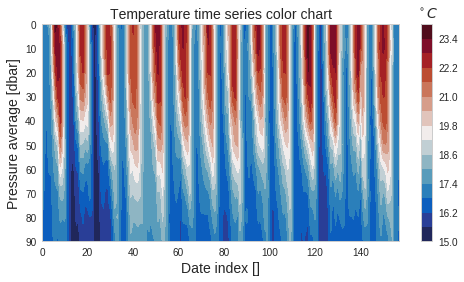

```{r setup, include=FALSE, echo = FALSE}
knitr::opts_chunk$set(fig.align = 'center', out.width = '90%',
                      message = FALSE, cache = TRUE)
setwd("~/Desktop/STAT676/bayes-time-series/Presentations/SST-Regression")
```


```{r, echo = FALSE}

```

## Outline

- SST data with covariates
- Use `bsts` to
    - Fit structural model with regression
    - Forecast
    - Custom regresson prior

## SST Data

- Sea Surface Temperature near Gibraltar
- Aggregated monthly
- January 2004 to November 2017
- Covariates: 10 meter thick water layers at 10, 20, ...,90  meters

## SST Data

```{r, echo = FALSE}

```

## SST Data

```{r, echo = FALSE}
library(readr)
library(bsts)
gib <- read_csv("./data/gilbralter_ts_reg.csv")
gib = gib[,-c(1,3)]
names(gib) = c("SST", "10m", "20m", "30m", "40m", "50m", "60m", "70m", "80m", "90m")
gib_train = gib[1:130,]
gib_test = gib[131:158,]


nseasons = 11
ss <- list()
ss <- AddLocalLinearTrend(ss, gib_train$SST)
ss <- AddSeasonal(ss, gib_train$SST, nseasons=nseasons)
lls_model <- bsts(gib_train$SST,
               state.specification=ss,
               niter=1000, ping=0)
#plot(lls_model, 'components')
lls_model_pred <- predict(lls_model, newdata=gib_test, horizon=12)
plot(lls_model_pred, plot.original = 36)
```

## Setup

```{r, eval = FALSE}
library(readr)
library(bsts)
gib <- read_csv("./data/gilbralter_ts_reg.csv")
gib = gib[,-c(1,3)]
names(gib) = c("SST", "10m", "20m", "30m",
               "40m", "50m", "60m", "70m",
               "80m", "90m")
```


## Model Fitting

### Local Trend With Seasonality and Regression

$\mu_t$: local linear trend 
$\tau_t$: seasonal component
$\beta^Tx_t$: regression component

\begin{align*}
&y_t = \mu_t + \tau_t + \beta^Tx_t  + \varepsilon_t &\varepsilon_t \sim N(0, \sigma^2_{\varepsilon})
\end{align*}

## SST Data

```{r, echo=FALSE}
print(gib[1:5, 1:5], digits=5)
```

## Forecasting Data
```{r, echo = TRUE}
gib_train = gib[1:130,]
gib_test = gib[131:158,]
```

## Model 1
Local linear, seasonal, and one linear component
```{r}
nseasons = 11
ss <- list()
ss = AddLocalLinearTrend(ss, y=gib_train$SST)
ss = AddSeasonal(ss, gib_train$SST, nseasons=nseasons)
rlls_model = bsts(SST ~ ., state.specification=ss,
                  data=gib_train, niter=1000, ping=0,
                  expected.model.size=1)
```

## Component Plotting
```{r}
plot(rlls_model, 'components')
```

## Covariate Significance
```{r}
plot(rlls_model, 'coefficients')
```

## Forcasting

```{r, fig.height=6}
rlls_model_pred = predict(rlls_model,
                          newdata=gib_test,
                          horizon = 28)
plot(rlls_model_pred, plot.original = 90)
```

## Model 2
Local linear, seasonal and two linear component model
```{r}
r2lls_model = bsts(SST ~ ., state.specification=ss,
                   data=gib_train, niter=1000, ping=0,
                   expected.model.size=2)
```


## Model 3
Specifying inclusion probabilities
```{r}
bp = c(.6,.3,.3,.3,.1,.1,.1,.1,.1,.1)
bp_model = bsts(SST ~ ., state.specification=ss,
                data=gib_train, niter=1000, ping=0,
                expected.model.size=2,
                prior.inclusion.probabilities=bp)
```

## Model Comparisons

```{r, echo=TRUE, fig.height=5}
CompareBstsModels(lwd = 4,
model.list = list("No reg." = lls_model,
"Model 1" = rlls_model, "Model 2" = r2lls_model,
"Model 3" = bp_model),
  colors = c("forestgreen","firebrick",
             "blue4", "black"))
```


